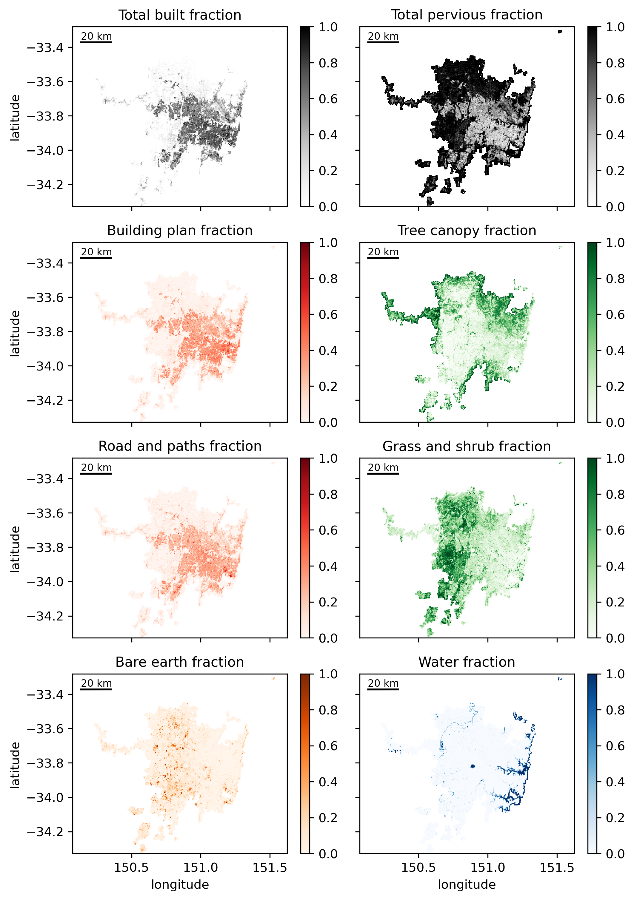
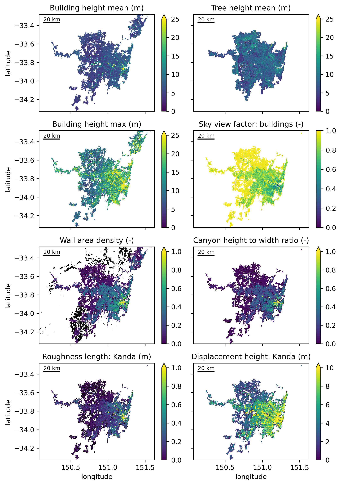

# Sydney morphology and land surface dataset

Associated manuscript: "A transformation in city-descriptive input data for urban climate models"

Citation for the open dataset:
 - Lipson, M., Nazarian, N., Hart, M. A., Nice, K. A., and Conroy, B.: Urban form data for climate modelling: Sydney at 300 m resolution derived from building-resolving and 2 m land cover datasets (v1.01), https://doi.org/10.5281/zenodo.6579061, 2022.

Location of associated code:
 - https://github.com/matlipson/geoscape_processing_public.git

## Dataset information

  - title: Urban form data for climate modelling: Sydney at 300 m resolution derived from building-resolving and 2 m land cover datasets
  - version: v1.01
  - institution: "ARC Centre of Excellence for Climate Extremes, UNSW Sydney, Australia
  - source: Developed using Geoscape Buildings v2.0, Trees v1.6 and Surface cover v1.6 (c) Geoscape Australia 2020. https://geoscape.com.au/legal/data-copyright-and-disclaimer/
  - licence: Data in this file is available under Creative Commons Attribution 4.0 International (CC-BY) with attribution: https://creativecommons.org/licenses/by/4.0/legalcode
  - author: Mathew Lipson <m.lipson@unsw.edu.au>
  - publication: A transformation in city-descriptive input data for urban climate models: Frontiers in Environmental Science 2022
  - publication_authors: Mathew Lipson, Negin Nazarian, Melissa hart, Kerry Nice, Brooke Conroy

## Description

This dataset for Sydney, Australia, represents land cover, building morphology, vegetation morphology and other parameters 
appropriate for input into local or mesoscale urban climate models.

The dataset is provided in netCDF4 and GeoTiff formats.

The python code `resample_geoscape_from_template.py` processes Geoscape Australia datasets for Buildings v2.0, 
Trees v1.6 and Surface cover v1.6 into lower resolution versions. For further details refer to the manuscipt:

"A transformation in city-descriptive input data for urban climate models: Frontiers in Environmental Science 2022"

The python code `plot_derived_dataset.py` plots select land cover and morphology parameters (figure outputs are included here).

## Version 1.01

This dataset version differs slightly from the one described in the associated paper, with the following changes.

- the ~ 300 m grid is based on the global European Space Agency CCI Global Land Cover dataset: https://www.esa-landcover-cci.org/
- additional land surface tiles are included where previously set to nan
- land surface tiles which did not sum to 1.0 were excluded (14 tiles)
- building height mean and standard deviation is still calculated from the average of Geoscape roof (max) and eave (min) heights. 
  An optional processing step is applied to account for buildings covering multiple grids where building vector information 
  is burnt to a raster and then area weighted to calculate grid-level statistics. This requires much longer processing time, 
  as well as additional  modules (GeoCube), however avoids the previous issue of the statistics of buildings over multiple grids
  being applied to one grid only. 
- building height maximum is now based only on Geoscape roof height (i.e. the maximum measured height). Again, an optional
  processing step is included based on rasterised data.
- the category lowveg_fraction is now partitioned into grass_fraction and shrub_fraction to allow seperate inputs used by some models

## Inputs:

- Geoscape Surface cover V1.6 (tiff)
- Geoscape Trees v1.6 (tiff) 
- Geoscape Buildings v2.0 (shp)
- template file for grid (here based on CCI)

## Outputs:

- cell_area: plan area of grid cell (m2)
- building_height: mean building height in grid cell (avg. of geoscape roof and eave height)
- building_height_max: maximum building height in grid cell (avg. of geoscape roof and eave height)
- building_height_std: standard deviation of building height in grid cell (avg. of geoscape roof and eave height)
- wall_density: sum of building wall area as fraction of grid area
- frontal_density: sum of cardinally averaged building frontal area as fraction of grid area
- tree_height: average vegetation canopy height in grid
- tree_height_std: standard deviation in vegetation canopy height in grid
- building_fraction: building footprint area as fraction of grid area, corrected for cloud and shadow fractions
- tree_fraction: tree canopy plan area as fraction of grid area, corrected for cloud and shadow fractions
- grass_fraction: grass as fraction of grid area, corrected for cloud and shadow fractions
- shrubs_fraction: shrubs and other vegetation not already classified as fraction of grid area, corrected for cloud and shadow fractions
- water_fraction: all open water (ocean, lakes, pools) as fraction of grid area, corrected for cloud and shadow fractions
- bareearth_fraction: bare earth including construction sites, rock, sand and sparsely vegetated areas as fraction of grid area, corrected for cloud and shadow fractions
- roadpath_fraction: all hard surfaces on ground excluding buildings, defined as "impervious surface fraction" in Stewart and Oke, 2012, corrected for cloud and shadow fractions
- total_built: all impervious surfaces including buildings, roads, paths and other hard surfaces, corrected for cloud and shadow fractions
- total_pervious: all pervious surfaces including vegetation, water and bare earth, corrected for cloud and shadow fractions
- height_to_width: average aspect ratio assuming street canyon geometry using Eq 1 of Masson et al. 2020: https://doi.org/10.1016/j.uclim.2019.100536
- skyview_factor: average skyview factor assuming street canyon geometry using Eq 2 of Masson et al. 2020: https://doi.org/10.1016/j.uclim.2019.100536
- displacement_mac: zero-plane displacement height, Eq. 23 from Macdonald et al., 1998: https://doi.org/10.1016/S1352-2310(97)00403-2
- roughness_mac: roughness length for staggered arrays. Eq. 26 from Macdonald et al., 1998: https://doi.org/10.1016/S1352-2310(97)00403-2
- displacement_kanda: zero-plane displacement height, Eq. 5 from Kanda et al., 2013: https://doi.org/10.1007/s10546-013-9818-x
- roughness_kanda: roughness length for staggered arrays, Eq. 6 from Kanda et al., 2013: https://doi.org/10.1007/s10546-013-9818-x

## Acknowledgements:

We gratefully acknowledge the Australian Urban Research Infrastructure Network (AURIN) and Geoscape Australia for 
providing the datasets necessary for this study, drawing on Geoscape Buildings, Surface Cover and Trees datasets, 
© Geoscape Australia, 2020: https://geoscape.com.au/legal/data-copyright-and-disclaimer/.  
This research was supported by the Australian Research Council (ARC) Centre of Excellence for Climate System Science 
(grant CE110001028), the ARC Centre of Excellence for Climate Extremes (grant CE170100023). 
